<div align="center">

<picture>
  <source media="(prefers-color-scheme: dark)" srcset="brand/ecc-lockup-dark.svg">
  
</picture>

<br><br>

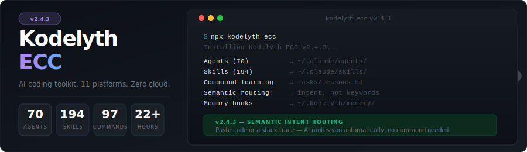

[](https://www.npmjs.com/package/kodelyth-ecc)
[](https://www.npmjs.com/package/kodelyth-ecc)
[](https://github.com/sifxprime/kodelyth-ecc/stargazers)
[](LICENSE)


</div>

**Kodelyth ECC** is a production-grade AI coding toolkit — **70 specialist agents (incl. an 8-agent devil-mode adversarial crew), 194 skills, 97 commands**, a god-tier **semantic intent-routing system**, local self-learning memory, MCP server, swarm orchestrator, and an observability dashboard — all local, zero telemetry.

Now bundled with:

- **RTK** (Rust Token Killer, Apache-2.0) — auto-compresses shell command output for **60-90% input token savings**
- **Terse mode** (ECC-native, inspired by Caveman) — 4-level output-token compression dial for **40-70% output savings**
- **Codebase graph** (via [codebase-memory-mcp](https://github.com/DeusData/codebase-memory-mcp), MIT) — AST-parsed knowledge graph across 158 languages; structural queries at **99% fewer tokens** than file-by-file grep
- **Interactive CLI** — type `kodelythecc` alone in a terminal for an arrow-key menu with live update check, dashboard, background daemon

Works with **Claude Code**, **Windsurf**, **Cursor**, **Codex CLI**, **Google Antigravity**, **OpenCode**, **Cline**, **Roo Code**, **Aider**, **Kimi**, and **Gemini CLI**.

> No telemetry. No cloud. Just rules, agents, skills, MCP server, and your own private memory store — all on your disk. The local dashboard gives you full visibility without sending anything anywhere.

---

## Why ECC ≠ Another Agent Collection

Most "AI agent kits" are folders of markdown files you have to remember the names of. **ECC is infrastructure** — a layered system where intent routing, compound memory, parallel orchestration, and quality hooks all reinforce each other.

```
You:   "I've been staring at this NullPointerException for two hours,
        I'm losing my mind."

AI:    → Routing to debug-detective (your error + frustration matches the bug-tracking signal)

       That kind of bug is exhausting — let's trace it properly so we
       fix the root cause, not the symptom.

       First, can you share the full stack trace and...
```

You never typed `use debug-detective`. You didn't have to. The toolkit read the intent, picked the specialist, and announced the routing. Next time you can invoke it directly — but you don't have to remember names to get senior-grade help.

### The Layer Stack

| Layer | What it does | Other kits |
|---|---|---|
| **Intent routing** | Plain-language → right specialist via 10-tier priority rules | Mostly missing — you memorize names |
| **70 agents** | Specialists with playbooks, severity calibration, real commands | Often persona-only ("you are a senior engineer...") |
| **194 skills** | Domain knowledge files agents read on demand | Rarely separated from agents |
| **97 commands** | Slash workflows (`/tdd`, `/devil-mode`, `/team-review`) | Limited or none |
| **8 parallel commands** | Fire 3-8 agents simultaneously, aggregate results | Rare |
| **Compound memory** | BM25 local recall + auto-inject + project lessons | Cloud-only or absent |
| **22+ hooks** | Quality gates, secret scan, project-DNA detection | Often missing |
| **11 IDE platforms** | Claude Code, Windsurf, Cursor, Codex, Antigravity, OpenCode, Cline, Roo Code, Aider, Kimi, Gemini CLI (13 install targets) | 1-2 platforms typical |
| **Zero telemetry** | Everything stays on your disk; verifiable | Many kits phone home |

### Quick Comparison vs Other Kits

| Feature | **Kodelyth ECC** | `agency-agents` | `awesome-claude-agents` | Generic prompt libs |
|---|---|---|---|---|
| Specialist agents | **70** | ~30 | ~20 | Varies |
| Skills as separate layer | ✅ 194 | ❌ | ❌ | ❌ |
| Slash commands | ✅ 97 | Some | Some | ❌ |
| **Parallel multi-agent commands** | ✅ 8 (incl. `/devil-mode`) | ❌ | ❌ | ❌ |
| **Intent routing (plain language → agent)** | ✅ 10-tier rule | ❌ | ❌ | ❌ |
| **Local BM25 self-learning memory** | ✅ | ❌ | ❌ | ❌ |
| **Compound learning from corrections** | ✅ `tasks/lessons.md` | ❌ | ❌ | ❌ |
| **Adversarial / red-team agents** | ✅ 8 (devil-mode) | ❌ | ❌ | ❌ |
| Quality hooks | ✅ 22+ | Some | ❌ | ❌ |
| IDE platforms | **11** (Claude Code, Windsurf, Cursor, Codex, Antigravity, OpenCode, Cline, Roo Code, Aider, Kimi, Gemini CLI) | 1-2 | 1 | Varies |
| Telemetry | ❌ none | Varies | ❌ | Varies |
| Test coverage | ✅ 373 tests | ❌ | ❌ | ❌ |
| Distributed via | `npx`, curl, clone | Manual | Manual | Manual |

---

## Install

<div align="center">
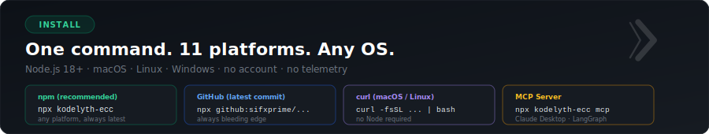
</div>

### The lazy install (one command, everything wired up)

```bash
npm i -g kodelyth-ecc
kodelythecc --target claude-code --codebase-graph
# then restart your AI tool
```

That's it. This single flow:

1. Installs both binaries (`kodelyth-ecc` and short-form `kodelythecc`) to your PATH
2. Copies 70 agents + 194 skills + 97 commands + 22 hooks + 14 rules into your AI tool's config dir
3. Auto-installs **RTK** binary and wires its PreToolUse hook (input compression starts on next AI restart)
4. Installs **Terse mode** skill + `/terse` and `/terse-compress` slash commands (dormant — user types `/terse` to activate)
5. Auto-installs **codebase-memory-mcp** and registers its MCP entries in your AI tool (with `--codebase-graph`)
6. Runs legacy-memory migration if you had `~/.kodelyth/` from an older install → `~/.kodelythecc/`

After it finishes, run `kodelythecc` alone to open the interactive menu.

### Option 1 — npx from npm (recommended, any platform)

```bash
npx kodelyth-ecc                              # Claude Code (default)
npx kodelyth-ecc --target windsurf-project    # Windsurf (per-project)
npx kodelyth-ecc --target windsurf-home       # Windsurf (global)
npx kodelyth-ecc --target cursor-project      # Cursor IDE
npx kodelyth-ecc --target codex-home          # Codex CLI
npx kodelyth-ecc --target antigravity         # Google Antigravity
npx kodelyth-ecc --target opencode            # OpenCode
npx kodelyth-ecc --target cline               # Cline (VS Code)
npx kodelyth-ecc --target roocode             # Roo Code (VS Code)
npx kodelyth-ecc --target aider               # Aider terminal agent
npx kodelyth-ecc --target kimi                # Kimi Code
npx kodelyth-ecc --target gemini-project      # Gemini CLI (project)
npx kodelyth-ecc --target gemini-home         # Gemini CLI (global)
```

Node.js 18+ required. [Download Node](https://nodejs.org) if you don't have it.

### Platform support at a glance

Feature depth varies by platform — hooks are a Claude Code native format, and some platforms have no agent/command concept:

| Platform | Agents | Skills | Commands | Hooks | Rules |
|---|---|---|---|---|---|
| **Claude Code** | ✓ 70 | ✓ 194 | ✓ 97 | ✓ 22+ | ✓ |
| **Roo Code** | ✓ | ✓ | ✓ | — | ✓ |
| **Codex CLI** | ✓ | ✓ | ✓ | — | ✓ |
| **Aider** | ✓ | ✓ | ✓ | — | ✓ |
| **Kimi** | ✓ | ✓ | ✓ | — | ✓ |
| **Windsurf** | ✓ | ✓ | — | — | ✓ |
| **Antigravity** | ✓ | partial | ✓ | — | ✓ |
| **Gemini CLI** | ✓ | ✓ | — | — | ✓ |
| **Cursor** | — | ✓ | — | — | ✓ |
| **Cline** | ✓ | — | ✓ | — | ✓ |
| **OpenCode** | — | — | — | — | ✓ |

Hooks use Claude Code's JSON settings format — no equivalent exists on other platforms. Cursor reads rules and skills from `.cursor/`; its agent system uses a different format not yet compatible with ECC agents.

### Memory & dashboard reality per IDE

Memory storage is a single shared file at `~/.kodelyth/memory/memories.jsonl` — every IDE on the same machine reads and writes the **same** memories. The only thing that varies is *how* memories surface:

| Platform | Auto-recall on every prompt | Auto-capture on success | Manual recall via MCP tool | Dashboard "Live IDE activity" |
|---|---|---|---|---|
| **Claude Code** | ✓ (hook) | ✓ (hook) | ✓ | ✓ Claude session files |
| **Windsurf** | — | — | ✓ `recall_memory` | ✓ Windsurf + Windsurf-Next state |
| **Cursor** | — | — | ✓ `recall_memory` | ✓ workspace storage dirs |
| **Codex CLI** | — | — | ✓ `recall_memory` | — |
| **Antigravity** | — | — | ✓ `recall_memory` | ✓ `.agent/` in cwd |
| **Roo Code / Aider / Kimi / Cline / Gemini CLI / OpenCode** | — | — | ✓ if MCP-capable | — |

What this means in practice:
- A memory captured in **Claude Code** is recall-able from every other IDE the same day — the file is shared.
- In **Windsurf / Cursor / Codex / Antigravity**, the AI does NOT auto-fire memory recall; the `rules/common/memory-protocol.md` rule (installed automatically) tells the AI to call the `recall_memory` MCP tool proactively at the start of substantive prompts.
- The dashboard's **Sessions → Live IDE activity** tab surfaces session files for Claude Code, Windsurf, Windsurf-Next, Cursor, and Antigravity. Add custom paths via the `KODELYTH_EXTRA_IDE_WATCH` env var (comma-separated).

```bash
# Watch additional paths in the dashboard
export KODELYTH_EXTRA_IDE_WATCH="$HOME/my-agent-logs,$HOME/other-tool/state"
npx kodelyth-ecc dashboard
```

### Option 2 — npx from GitHub (always latest commit)

```bash
npx github:sifxprime/kodelyth-ecc
```

Same `--target` flags work.

### Option 3 — curl (macOS / Linux only)

```bash
curl -fsSL https://raw.githubusercontent.com/sifxprime/kodelyth-ecc/main/install.sh | bash
```

With a target:

```bash
curl -fsSL https://raw.githubusercontent.com/sifxprime/kodelyth-ecc/main/install.sh | bash -s -- --target windsurf-project
```

### Power Bundles

Pre-configured for who you actually are:

```bash
npx kodelyth-ecc --bundle indie-hacker    # Solo founder / SaaS — ship fast, validate, harden
npx kodelyth-ecc --bundle red-team        # Security engineer — devil-mode + adversarial workflows
npx kodelyth-ecc --bundle enterprise      # Compliance / audit team — SBOM, license, supply chain
```

Each bundle installs the full ECC toolkit (all 70 agents, 194 skills, 97 commands, 22+ hooks), adds a `BUNDLE.md` cheat sheet, and biases the AI toward audience-fit workflows on every session.

Combine with any target:

```bash
npx kodelyth-ecc --bundle red-team --target windsurf-project
npx kodelyth-ecc --bundle enterprise --target codex-home
npx kodelyth-ecc --bundle indie-hacker --target antigravity
```

### Option 4 — Clone and run

```bash
git clone https://github.com/sifxprime/kodelyth-ecc.git
cd kodelyth-ecc

# macOS / Linux
./install.sh                              # Claude Code (default)
./install.sh --target windsurf-project    # Windsurf

# Windows (PowerShell)
.\install.ps1
.\install.ps1 -Target windsurf-project
```

---

## MCP Server — Universal Adapter

<div align="center">
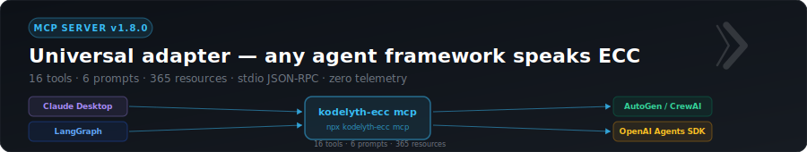
</div>

Run ECC as a Model Context Protocol server and consume it from Claude Desktop, LangGraph, AutoGen, CrewAI, OpenAI Agents SDK, Cursor, Windsurf — anything that speaks MCP.

```bash
npx kodelyth-ecc mcp                         # stdio JSON-RPC server
```

What it exposes (all local, zero telemetry):

- **16 tools** — `route_intent`, `recall_memory`, `capture_memory`, `list_agents`, `get_skill`, `audit_skill_match`, …
- **6 prompts** — full intent routing rule, agents/skills/commands overviews, handoff chains, devil-mode
- **365 resources** — every agent, skill, command, rule, and bundle addressable via `kodelyth://...` URIs

Drop into Claude Desktop in 30 seconds:

```jsonc
// claude_desktop_config.json
{
  "mcpServers": {
    "kodelyth-ecc": {
      "command": "npx",
      "args": ["-y", "kodelyth-ecc", "mcp"]
    }
  }
}
```

Full reference: [`docs/mcp.md`](docs/mcp.md).

---

## How Intent Routing Works

<div align="center">
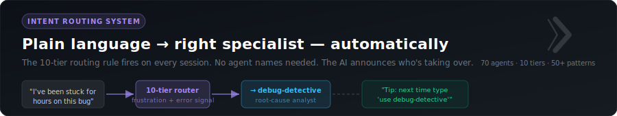
</div>

The toolkit ships with a single rule file (`rules/common/agent-intent-routing.md`) that the AI loads automatically on every session. It maps **what you say** to **the right specialist agent** across 10 priority tiers.

### Two activation paths

**1. Explicit** — type it directly:
```
use debug-detective
@code-reviewer
invoke security-reviewer
```

**2. Implicit** — just describe your problem; the AI routes you:

| What you write | Auto-routed to |
|---|---|
| "I'm stuck, no idea where to start" | `kodelyth-advisor` |
| "I've been debugging this for hours" | `debug-detective` |
| "nothing works, driving me crazy" | `debug-detective` |
| "Should I use Context or Zustand?" | `pair-programmer` |
| "help me build a todo app" | `/project-launch` |
| "I have this idea for a SaaS dashboard" | `/project-launch` |
| "I'm starting a new side project" | `/project-launch` |
| "can you review my code?" | `code-reviewer` or `/team-review` |
| "review my project before I deploy" | `/team-review` |
| "is my project ready to ship?" | `/team-review` |
| "my site looks plain, needs visuals" | `image-architect` |
| "I need an OG image for my app" | `image-architect` |
| "remember we always use pnpm here" | `/lessons` |
| "Build failed on Vercel" | `build-error-resolver` |
| "Is this JWT signing secure?" | `security-reviewer` |
| "Why is this so slow?" | `performance-optimizer` |
| "Plan the v2 migration" | `planner` + `migration-guide` |
| "Tests pass locally but fail on CI" | `flake-hunter` + `env-debugger` |
| "I lost my commits after `reset --hard`" | `git-rescue` |
| "npm install is failing" | `dependency-doctor` |
| "Cut a 1.4 release" | `release-captain` |
| "Add accessibility to this form" | `ux-reviewer` |
| "Open-source this project" | `opensource-forker` (chain) |
| [paste code with no text] | `code-reviewer` |
| [paste stack trace with no text] | `debug-detective` |

The AI **always announces** which agent is taking over (`→ Routing to <agent>`) and **always teaches** you the explicit form for next time (`Tip: type "use <agent>"`). No silent personality changes.

### Multi-agent chains

Real problems span multiple specialties. ECC ships standard handoff chains:

```
pair-programmer  →  tdd-guide  →  code-reviewer  →  security-reviewer
(approach)         (write tests)  (review impl)     (auth, validation)
```

```
debug-detective  →  tdd-guide        →  refactor-cleaner
(root cause)        (regression test)   (cleanup)
```

```
opensource-forker  →  opensource-sanitizer  →  opensource-packager  →  release-captain
(clean fork)          (strip secrets)            (README, license)        (cut v0.1.0)
```

See `skills/agent-handoff/SKILL.md` for the full handoff protocol and standard chains.

---

## Parallel Agents — 8 Commands, Minutes Not Hours

<div align="center">
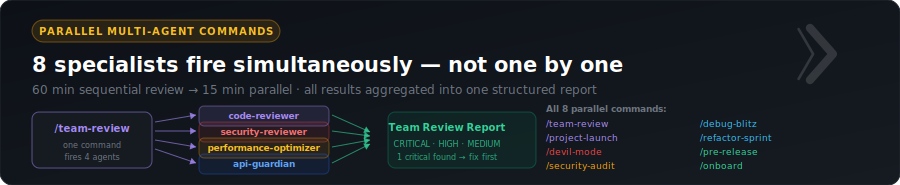
</div>

Eight commands fire multiple specialist agents simultaneously and aggregate their results into a single structured report.

| Command | Agents Fired | Time Saved |
|---|---|---|
| `/project-launch` | architect + pair-programmer + security-reviewer + tdd-guide + ux-reviewer | 45 min → 10 min |
| `/team-review` | code-reviewer + security-reviewer + performance-optimizer + api-guardian | 60 min → 15 min |
| `/security-audit` | security-reviewer + dependency-doctor + api-guardian | 30 min → 8 min |
| `/debug-blitz` | debug-detective + silent-failure-hunter + env-debugger | 60 min → 15 min |
| `/refactor-sprint` | refactor-cleaner + code-simplifier + type-design-analyzer + tdd-guide | 45 min → 12 min |
| `/pre-release` | release-captain + security-reviewer + code-reviewer | 30 min → 8 min |
| `/onboard` | code-explorer + architect + doc-updater | 45 min → 12 min |
| `/devil-mode` | 8 adversarial agents (see below) | Hours → 20 min |

Each command waits for all agents to complete, then returns a single **Team Review Report** with findings bucketed by severity: CRITICAL → HIGH → MEDIUM → LOW.

---

## Devil Mode — 8 Adversarial Agents

<div align="center">
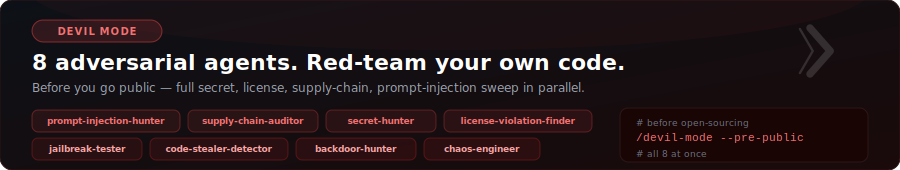
</div>

8 adversarial agents that read your codebase the way an attacker would. Fire them in parallel with `/devil-mode`:

```
/devil-mode --pre-public    # before going open-source — full secret/license/IP sweep
/devil-mode --pre-launch    # before launch — adds AI red-team + chaos planning
/devil-mode --all           # all 8 adversarial agents in parallel
```

The crew: `prompt-injection-hunter`, `supply-chain-auditor`, `secret-hunter`, `license-violation-finder`, `jailbreak-tester`, `code-stealer-detector`, `backdoor-hunter`, `chaos-engineer`. Each ships with real bash-grep patterns, severity calibration, and remediation playbooks — not theatrical personas.

---

## Live Dashboard — Full Visibility, Localhost Only

<div align="center">
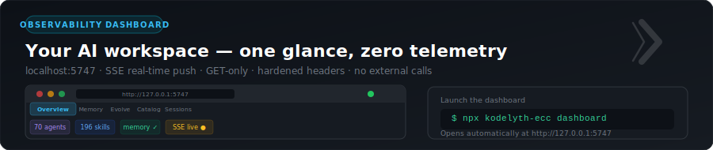
</div>

**You have a working, real-time dashboard.** One command launches it:

```bash
npx kodelyth-ecc dashboard
# Opens http://127.0.0.1:5747 in your browser
```

What's inside:

| Tab | What you see |
|---|---|
| **Overview** | Agent count, memory stats, session count, recent activity |
| **Memory** | Browse, search, and manage your local BM25 memory store |
| **Evolve** | Self-improving memory — review AI-proposed refinements |
| **Catalog** | Full searchable index of all 70 agents, 194 skills, 97 commands |
| **Sessions** | **Live IDE activity** (Claude Code, Windsurf, Windsurf-Next, Cursor, Antigravity) + orchestration/swarm sessions |

Real-time:
- SSE push every 3 seconds, only when at least one browser tab is connected (zero CPU otherwise)
- Watches memory writes, evolve signals, token-budget changes, and IDE session files
- "Last activity" auto-updates without a page refresh
- Set `KODELYTH_EXTRA_IDE_WATCH=path1,path2` to watch additional paths

Security design:
- **GET-only** — no write endpoints accessible from the UI
- **Localhost-bound** — refuses connections from non-localhost Host headers (DNS rebinding protection)
- **Hardened headers** — `Content-Security-Policy`, `X-Frame-Options`, `X-Content-Type-Options` on every response
- **Zero telemetry** — no external network calls ever leave your machine
- **Max 10 SSE clients** — connection cap prevents resource exhaustion

Full reference: [`docs/dashboard.md`](docs/dashboard.md).

---

## RTK — Input Token Savings (60-90%)

<div align="center">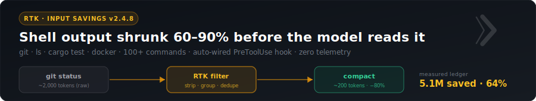</div>

[RTK (Rust Token Killer)](https://github.com/rtk-ai/rtk) — Apache-2.0, single Rust binary — intercepts shell commands before they run and filters the output. Common commands like `git status`, `ls`, `cargo test`, `docker ps` return ~80% less text with zero information loss for the LLM.

ECC bundles RTK end-to-end:

- Auto-installs the binary via Homebrew (macOS) or curl script (Linux / WSL)
- Auto-configures the PreToolUse hook in your AI tool's settings
- Live ledger surfaced in the dashboard's **Token Savings** tab

### Manage from the CLI

```bash
kodelythecc rtk install                # install rtk binary
kodelythecc rtk enable --target X      # wire into one IDE
kodelythecc rtk enable --all           # wire into every ECC-installed IDE at once
kodelythecc rtk status                 # version + active integrations
kodelythecc rtk gain --all             # raw rtk savings output
kodelythecc rtk --help                 # focused help
```

### Live proof (from this repo maintainer's Mac)

```
total_commands:    1,285
total_input:       7,964,612    (raw)
total_output:      2,858,501    (after RTK filter)
total_saved:       5,107,394    ← 64.1% average reduction
```

---

## Terse Mode — Output Token Savings (40-70%)

<div align="center">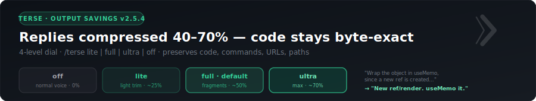</div>

RTK compresses input. **Terse mode** compresses output. Together they stack — savings on both sides of every turn.

ECC's own implementation, inspired by [Caveman](https://github.com/JuliusBrussee/caveman) (MIT), independently written. Ships as a skill + two slash commands + a deterministic zero-dep memory-file compressor.

### Four levels

Type `/terse` in your AI tool. Level sticks until you switch or session ends.

| Level | Style |
|---|---|
| `/terse off` | Normal AI voice |
| `/terse lite` | Light trim, drop filler ("basically", "essentially") |
| `/terse full` | Telegram-style fragments (default) |
| `/terse ultra` | Maximum compression, symbols over words |

**Byte-preserved always**: fenced code blocks, inline code, shell commands, error text, URLs, file paths, identifiers, numbers, versions.

### Compress memory files permanently

`/terse-compress` (or `kodelythecc terse compress <file>`) rewrites `CLAUDE.md`-style memory files into terse form so they cost fewer tokens **every session forever**. ~30% average byte reduction on real prose, 100% code/URL/path integrity.

### CLI

```bash
kodelythecc terse status                # skill install state
kodelythecc terse stats                 # tokens saved from ledger
kodelythecc terse compress <file>       # rewrite a file, byte-preserves code
kodelythecc terse enable --all          # install skill + commands into every ECC IDE
kodelythecc terse --help
```

---

## Codebase Graph — 158 Languages, Structural Queries

<div align="center">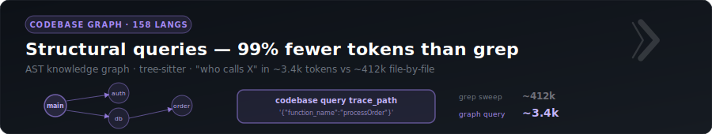</div>

Powered by [DeusData/codebase-memory-mcp](https://github.com/DeusData/codebase-memory-mcp) (MIT). AST-parsed knowledge graph via tree-sitter across **158 languages**, Hybrid LSP semantic type resolution for 11 major languages, cross-service HTTP/gRPC/GraphQL linking, 14 MCP tools for structural queries.

**Why this matters**: "Who calls `ProcessOrder`?" via file-by-file grep = ~412k tokens. Same question via the graph = ~3.4k tokens. That's a **99% reduction** on structural questions.

### Auto-install path

Pass `--codebase-graph` on ECC install and it auto-runs their official curl script + auto-configures the MCP server entry in every installed AI-coding agent.

```bash
kodelythecc --target claude-code --codebase-graph
# ↑ installs ECC + RTK + Terse + codebase-memory-mcp, all wired up
```

Then in your AI tool, say **"Index this project"**. Done.

### CLI

```bash
kodelythecc codebase install                              # install + auto-register
kodelythecc codebase status                               # version + indexed projects
kodelythecc codebase query search_graph '{"name_pattern": ".*Handler.*"}'
kodelythecc codebase query trace_path '{"function_name": "main"}'
kodelythecc codebase query get_architecture '{}'
kodelythecc codebase --help
```

---

## Interactive CLI Menu

<div align="center">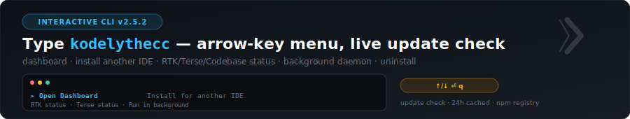</div>

Type `kodelythecc` alone in a real terminal → arrow-key menu opens.

```
⚙ Kodelyth ECC  v2.3.0  ·  Elite Code Crew   up to date

 ▸ Open Dashboard                     localhost — RTK, Terse, Codebase, Memory
   Install ECC for another IDE        13-target picker
   RTK status                         Version + wired IDEs + savings
   Terse status                       Skill install state, ledger totals
   Codebase graph status              158 languages, structural queries
   Memory stats                       BM25 recall — captures, projects, tags
   Run in background                  Detached dashboard daemon
   Exit

↑/↓ navigate  ·  ⏎ select  ·  q / esc / Ctrl+C to quit
```

### Behaviour rules

| Situation | Menu opens? |
|---|---|
| `kodelythecc` in Terminal / iTerm | **Yes** |
| `kodelythecc rtk status` (any subcommand) | No — runs subcommand |
| `echo hi \| kodelythecc` (piped) | No — runs installer |
| CI environment (`$CI` set) | No |
| `KODELYTH_NO_MENU=1 kodelythecc` | No |

### Uninstall

The menu's **Uninstall ECC completely** row runs an interactive full cleanup: removes the 759 ECC-installed files from `~/.claude/`, unwires RTK from your AI tool, removes codebase-memory-mcp agent configs, removes ECC's MCP entry from Claude Code + Claude Desktop, and deletes `~/.kodelythecc/` (memory + ledgers). Prompts confirm before anything is deleted; a dry-run mode previews what would be removed without touching anything.

You can also run it non-interactively:

```bash
kodelythecc uninstall --dry-run           # preview what would be removed
kodelythecc uninstall --yes                # full cleanup
kodelythecc uninstall --yes --keep-memory  # remove files but keep ~/.kodelythecc/
npm uninstall -g kodelyth-ecc              # finally remove the npm package itself
```

### Update check

The menu polls `https://registry.npmjs.org/kodelyth-ecc/latest` on open. Cached 24h in `~/.kodelythecc/update-check.json`. When a newer version exists, an extra menu row appears at the top:

```
 ▸ Update to v2.3.1 [NEW]              npm i -g kodelyth-ecc
```

### Background daemon

Selecting "Run in background" forks the dashboard as a detached process:

```
✓ Dashboard daemon started (pid 12345)
  URL:    http://127.0.0.1:5747
  Log:    /Users/you/.kodelythecc/dashboard-daemon.log
  Pid:    /Users/you/.kodelythecc/dashboard-daemon.pid
  Stop:   kill $(cat ~/.kodelythecc/dashboard-daemon.pid)
```

Survives shell exit. Real daemon.

---

## Kodelyth Memory — Local Self-Learning

<div align="center">
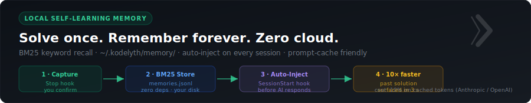
</div>

The first time you solve a hard problem, ECC remembers what worked. The next time you hit something similar, your AI surfaces the past solution before you ask.

```
Session 1 (March):
  You:  "Stripe webhook signatures are failing in production"
  AI:   [helps you debug, you discover raw body parser is required]
  You:  "Perfect, that worked, thanks"
  → ECC's Stop hook queues the lesson for review.
  → You confirm with /memory review-pending → stored locally.

Session 2 (August, new project):
  You:  "I need to add Stripe webhooks to checkout"
  AI:   I checked your memory — you solved this exact problem in March.
        Raw body parser before signature validation, test with stripe-cli
        not curl. Want me to apply the same pattern?
  You:  "Yes, do it"
  → 30 minutes of past debugging saved in 3 seconds.
```

### How it works

| Layer | Mechanism |
|---|---|
| **Capture** | A Stop hook scans your session JSONL, extracts (problem, approach, gotchas, tags). Queues for your review — never auto-stores. |
| **Storage** | `~/.kodelyth/memory/memories.jsonl` — append-only log on your disk only. Override with `KODELYTH_MEMORY_DIR`. |
| **Retrieval** | BM25 keyword + tag search. Pure JS, sub-millisecond, no embeddings, no network. |
| **Session-start injection** | A SessionStart hook builds a cache-friendly context block: stable prefix (your patterns + recent project memories) → variable suffix (relevant to current task). |
| **Auto chat detection** | A `UserPromptSubmit` hook watches every message you type, runs BM25 search on it, and injects relevant memories **before the AI responds**. Per-session repeat suppression. |
| **Cost win** | The stable prefix sits in the prompt cache. Anthropic charges 10% on cached tokens (5-min TTL); OpenAI auto-caches prefixes ≥1024 tokens. Long sessions become dramatically cheaper. |

### Privacy

Every byte stays on your machine. Verify any time with `ls -la ~/.kodelyth/memory/`. Sync across machines is opt-in (Dropbox/iCloud/git on that folder).

### Slash command

```
/memory                          # Stats and recent memories
/memory recall <query>           # BM25 search
/memory remember "<title>"       # Capture (interactive — confirms before storing)
/memory review-pending           # Review Stop-hook candidates
/memory forget <id>              # Soft-delete a memory
/memory inject [--query <text>]  # Print what your AI sees about you
```

### Honest limits

- It is **not** model fine-tuning. The LLM never changes. We give it smarter context.
- Cache savings apply to Anthropic and OpenAI. Other models (Gemini, Llama, Mistral) get the recall quality without the discount.
- Cloud-AI platforms (Windsurf, Antigravity, partial Cursor) store sessions server-side. Auto-extract from past sessions doesn't work there. Manual `/memory remember` still does.

See `skills/kodelyth-memory/SKILL.md` for the full design + CLI reference.

---

## Compound Learning System — Self-Improvement Loop

<div align="center">
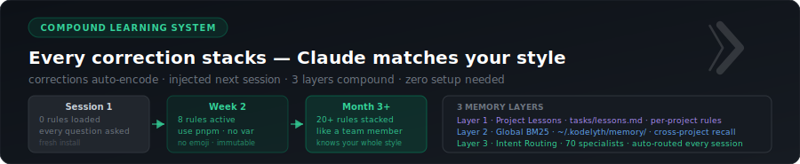
</div>

Every correction you give Claude gets encoded into your project permanently. The toolkit gets smarter every session without any effort from you.

```
Session 1:  You type "use pnpm not npm"
            → Session ends
            → capture-correction.js scans the JSONL
            → Writes to tasks/lessons.md: "- use pnpm not npm"

Session 2:  read-lessons.js fires at session start
            → Injects: "PROJECT LESSONS — HARD RULES: - use pnpm not npm"
            → Claude uses pnpm without being told

Month 1:    10+ corrections stacked
            → Claude knows your naming style, preferred patterns, tech opinions
            → Zero ramp-up time on any new task

Month 3:    You try another tool
            → It uses npm. It uses the wrong pattern. It asks basic questions.
            → You come back.
```

### Three-layer compound memory architecture

| Layer | File | Scope | How it works |
|---|---|---|---|
| **Project Lessons** | `tasks/lessons.md` | Per-project | Hard rules from your corrections. Injected at session start as mandatory context. |
| **Global Memory** | `~/.kodelyth/memory/` | Cross-project | BM25 fuzzy recall of past solutions. Auto-fires on every prompt you type. |
| **Intent Routing** | 70 agents | Always-on | Routes your message to the right specialist from the first word. No names needed. |

### How it works under the hood

**`capture-correction.js`** — Stop hook, runs async at session end:
- Scans session JSONL for 12 correction signal patterns (`"no don't"`, `"use X instead"`, `"stop doing Y"`, `"we always"`, `"wrong approach"`, etc.)
- Extracts them as plain-language rules
- Appends them to `tasks/lessons.md` with date grouping

**`read-lessons.js`** — SessionStart hook, fires first before any other hook:
- Reads `tasks/lessons.md` and formats rules as `PROJECT LESSONS — HARD RULES` block
- Detects project DNA automatically: Node.js + framework (Next.js, React, NestJS, etc.), Go, Rust, Python, Java/Gradle, package manager (pnpm/bun/yarn/npm), test runner
- Surfaces open `tasks/todo.md` items into session context

### `tasks/lessons.md` — your project's rulebook

Edit it freely. Add rules manually. Remove rules that no longer apply. It's a plain markdown file at `tasks/lessons.md` in your project root.

```markdown
# Claude Lessons

Project: **my-app**

## 2026-05-06

- use pnpm not npm
- never add try/catch without logging the error first
- we use Zod for validation, not Yup
- component files go in src/components, not src/app
```

---

## What's Inside

| Component | Count | Description |
|---|---|---|
| Agents | **70** | Specialist subagents — reviewers, planners, debuggers, architects, devil-mode adversarial crew, incident-commander, load-tester, memory, image-architect |
| Skills | **194** | Domain knowledge — patterns, testing, security, DevOps, intent routing, memory |
| Commands | **97** | Slash command workflows (`/tdd`, `/plan`, `/memory`, `/devil-mode`, `/doctor`, `/update`, etc.) |
| Parallel commands | **8** | `/devil-mode`, `/team-review`, `/security-audit`, `/debug-blitz`, `/refactor-sprint`, `/pre-release`, `/onboard`, `/project-launch` |
| Hooks | **22+** | Quality gates, secret scanning, branch checks, memory inject + capture + correction + project DNA |
| Rules | **14** | Always-on coding standards + intent routing + memory protocol + self-improvement workflow |
| Memory | **local** | BM25-indexed personal memory at `~/.kodelyth/memory/` (zero deps) |

---

## Agent Arsenal

<div align="center">
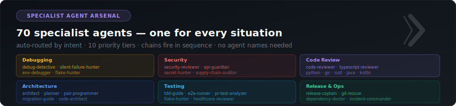
</div>

<div align="center">
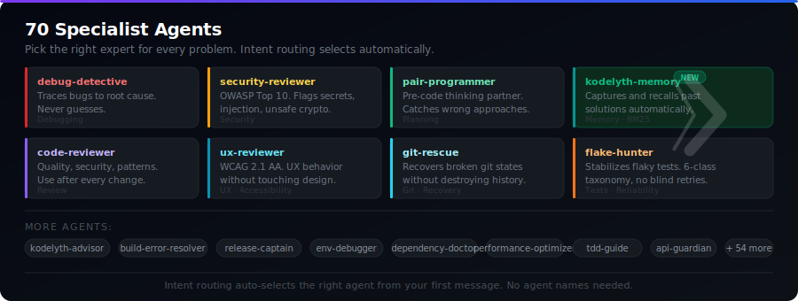
</div>

### Kodelyth Exclusives — The 16 Agents That Make ECC

| Agent | One-line job |
|---|---|
| `kodelyth-advisor` | Master guide — picks the right tool when you don't know where to start |
| `kodelyth-memory` | Curates your local memory — recalls past solutions, captures new ones |
| `pair-programmer` | The engineer who sits next to you **before** you write the code |
| `debug-detective` | Never guesses — traces every bug to root cause |
| `silent-failure-hunter` | Finds bugs that don't throw errors |
| `incident-commander` | Runs production incidents — triage, contain, postmortem. P0s only. |
| `load-tester` | Load and stress testing — k6, Locust, Artillery, capacity planning |
| `ux-reviewer` | Reviews UX behavior + WCAG 2.1 AA accessibility (never touches design) |
| `api-guardian` | Detects breaking API changes before they ship |
| `migration-guide` | Framework / language version upgrades, phase by phase |
| `dependency-doctor` | npm/pip/cargo/maven hell — CVE triage, lockfile diagnosis |
| `git-rescue` | Recovers from broken git states without destroying history |
| `release-captain` | Owns the release ritual — semver, tagging, publishing, rollback |
| `env-debugger` | "Works on my machine" hunter — env, config, secrets, layers |
| `flake-hunter` | Stabilizes flaky tests — never adds blind retries |
| `image-architect` | AI image generation — Gemini/DALL-E/fal.ai/SVG, platform-aware |

### Agent Categories

| Category | Agents |
|---|---|
| **Guidance** | `kodelyth-advisor`, `pair-programmer`, `planner`, `architect`, `code-architect`, `chief-of-staff`, `migration-guide` |
| **Code Review** | `code-reviewer`, `typescript-reviewer`, `python-reviewer`, `go-reviewer`, `rust-reviewer`, `java-reviewer`, `kotlin-reviewer`, `cpp-reviewer`, `csharp-reviewer`, `flutter-reviewer`, `database-reviewer`, `healthcare-reviewer` |
| **Build Fixers** | `build-error-resolver`, `go-build-resolver`, `rust-build-resolver`, `java-build-resolver`, `kotlin-build-resolver`, `cpp-build-resolver`, `dart-build-resolver`, `pytorch-build-resolver`, `dependency-doctor`, `env-debugger` |
| **Debugging** | `debug-detective`, `silent-failure-hunter`, `flake-hunter` |
| **Incident & Load** | `incident-commander`, `load-tester` |
| **Security & API** | `security-reviewer`, `api-guardian` |
| **Performance** | `performance-optimizer` |
| **Quality** | `refactor-cleaner`, `code-simplifier`, `type-design-analyzer` |
| **Testing** | `tdd-guide`, `e2e-runner`, `pr-test-analyzer`, `flake-hunter` |
| **Documentation** | `doc-updater`, `docs-lookup`, `comment-analyzer` |
| **Release & Ops** | `release-captain`, `git-rescue` |
| **Open Source** | `opensource-forker`, `opensource-packager`, `opensource-sanitizer` |
| **Specialized** | `seo-specialist`, `ux-reviewer`, `code-explorer` |

---

## Hooks — Always Running in Background

<div align="center">
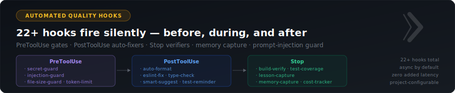
</div>

Once installed (Claude Code target), these hooks run automatically with zero configuration:

| Hook | What it does |
|---|---|
| Session start — lessons | Reads `tasks/lessons.md` and injects your hard rules + project DNA as context |
| Session start — memory | Loads relevant past solutions from global BM25 memory |
| Auto chat recall | Watches every prompt, injects relevant memories before AI responds |
| Correction capture | Detects when you correct Claude, encodes the rule to `tasks/lessons.md` |
| Pre-commit | Catches `console.log`, secrets, bad commit messages |
| Quality gate | Runs type checks and formatting after edits |
| Git push reminder | Prompts review before pushing |
| Config protection | Blocks weakening of linter/formatter configs |
| Desktop notify | macOS notification when a long task finishes |
| MCP health check | Validates MCP servers before calling them |
| Test reminder | Prompts to write tests when code is edited without tests |
| Branch name check | Blocks git branches that don't match naming convention |

---

## Usage After Install

### Start here (new users)

```
/kodelyth-quickstart
```

### Core workflows — explicit invocation

```bash
use kodelyth-advisor      # Not sure what to do? Start here
use pair-programmer       # Think through approach before writing code
use planner               # Plan a feature before writing code
use code-reviewer         # Review after writing code
use debug-detective       # Trace a bug to its root cause
use api-guardian          # Check API changes for breaking contracts
use security-reviewer     # Review security-sensitive code
use ux-reviewer           # Review frontend UX and accessibility
use migration-guide       # Upgrading a framework or language version
use tdd-guide             # Write tests the right way
use performance-optimizer # Diagnose and fix slowness
use dependency-doctor     # npm/pip/cargo dep hell
use git-rescue            # Broken git state, lost commits, bad rebase
use release-captain       # Cut a clean release with rollback plan
use env-debugger          # "Works on my machine" — env/config/secrets
use flake-hunter          # Stabilize flaky tests
```

### Or just describe your problem

The intent router will route you to the right one. The AI announces who's taking over, helps you, and tells you the explicit name for next time.

### Load language patterns (skills)

```bash
/typescript-patterns    # TypeScript + React + Next.js
/python-patterns        # Python best practices
/golang-patterns        # Go best practices
/postgres-patterns      # Database patterns
/docker-patterns        # Container patterns
/coding-standards       # Universal baseline
```

### Advanced skills

```bash
/git-mastery            # Trunk-based dev, rebase, bisect, monorepos
/observability          # Structured logging, metrics, OpenTelemetry, SLOs
/smart-debug            # Systematic debugging framework
/intent-routing         # How the auto-routing system works
/agent-handoff          # Standard multi-agent handoff chains
```

---

## What Gets Installed

### Claude Code — `~/.claude/`

| Source | Destination | What it does |
|---|---|---|
| `agents/` | `~/.claude/agents/` | All 70 subagents available globally |
| `skills/` | `~/.claude/skills/` | All 194 skills loadable via commands |
| `hooks/hooks.json` | `~/.claude/hooks/` | Automated quality gates |
| `rules/` | `~/.claude/rules/` | Always-on standards + intent routing |
| `commands/` | `~/.claude/commands/` | Slash commands (`/tdd`, `/plan`, etc.) |

### Windsurf — `.windsurf/` (project) or `~/.codeium/windsurf/` (global)

| Source | Destination | Notes |
|---|---|---|
| `agents/` | `.windsurf/agents/` | Call with `use <agent-name>` in Cascade |
| `skills/` | `.windsurf/skills/` | Domain knowledge, loadable via chat |
| `rules/` | `.windsurf/rules/` | Flattened rule files |
| `rules/common/` | `.windsurfrules` | Concatenated — Windsurf reads this automatically every session |

### Cursor — `.cursor/` in project root

| Source | Destination |
|---|---|
| `rules/` | `.cursor/rules/` |
| `skills/` | `.cursor/skills/` |

### Codex CLI — `~/.codex/`

| Source | Destination |
|---|---|
| `agents/` | `~/.codex/agents/` |
| `skills/` | `~/.codex/skills/` |
| `commands/` | `~/.codex/commands/` |
| `rules/` | `~/.codex/rules/` |

### Antigravity — `.agent/` in project root

| Source | Destination |
|---|---|
| `agents/` | `.agent/skills/` |
| `commands/` | `.agent/workflows/` |
| `rules/` | `.agent/rules/` |

### OpenCode — `.opencode/` in project root

| Source | Destination |
|---|---|
| `rules/` | `.opencode/rules/` |

---

## Install Profiles — Language Bundles

Works with any target:

```bash
npx kodelyth-ecc --profile nextjs                              # Claude Code
npx kodelyth-ecc --target windsurf-project --profile nextjs    # Windsurf
npx kodelyth-ecc --target antigravity --profile python-api     # Antigravity
```

Available profiles:

| Profile | Includes |
|---|---|
| `nextjs` | TypeScript + React + Next.js rules |
| `python-api` | Python + Django/FastAPI rules |
| `fullstack` | TypeScript + Python + Go rules |
| `mobile` | Kotlin + Swift rules |
| `backend` | Go + Python + Java rules |

Or specify languages directly:

```bash
npx kodelyth-ecc typescript python golang rust java kotlin php swift cpp dart ruby elixir
```

---

## Multi-Platform Support

| Platform | Supported | Install target | What gets installed |
|---|---|---|---|
| Claude Code | Full | `claude-home` (default) | Agents, skills, commands, hooks, rules |
| Windsurf | Full | `windsurf-project` / `windsurf-home` | Agents, skills, rules, `.windsurfrules` |
| Cursor | Full | `cursor-project` | Rules, skills |
| Codex CLI | Full | `codex-home` | Agents, skills, commands, rules |
| Google Antigravity | Full | `antigravity` | Agents → skills, commands → workflows, rules |
| OpenCode | Rules only | `opencode` | Rules (agents + skills not yet supported by OpenCode) |

**OS support:** macOS, Linux (`install.sh`), Windows (`install.ps1`), or any OS with Node.js 18+ (`npx`).

---

## Privacy & Philosophy

ECC is **100% local files**. No telemetry, no cloud, no account, no tracking. Everything is markdown your AI reads on every session.

- **No phoning home** — install scripts copy files and exit. MCP server, dashboard, swarm, and replay all stay on localhost.
- **You own everything** — fork the repo, edit any agent, write your own.
- **Verifiable** — `npx kodelyth-ecc verify` checks your install against the sha256 manifest.

---

## Contributing

We welcome new agents, skills, hooks, and intent routing patterns that meet the **Kodelyth Standard** — specialist personas, model-agnostic, production-grade examples.

When adding a new agent, also update `rules/common/agent-intent-routing.md` with your trigger patterns so the intent router knows when to call you.

See [CONTRIBUTING.md](CONTRIBUTING.md) for templates, checklists, and the full Kodelyth Standard.

---

## Changelog

See [CHANGELOG.md](CHANGELOG.md). v1.8.0 highlights:

- **Visual system overhaul** — `github-social-preview.svg` and `og-image.svg` fully redesigned with two-panel layout: brand left, 2×2 stat cards right, dot grid texture, amber accent
- **SVG overflow fixes** — KODELYTH wordmark, bottom bar text, and stats numerals all corrected to stay within canvas bounds across all 31 social assets
- **Test count update** — 373 tests across 25 test files (up from 348)
- **4K PNG exports** — all 31 social assets regenerated at 4× scale; fullhd exports removed

v1.7.3 highlights:

- **Social hype pack** — 5 X/Twitter SVG cards + 5 thread scripts, full SVG version sync, GitHub issue templates, repo polish

v1.7.0 highlights:

- **MCP Server** — 16 tools, 6 prompts, 377 resources; stdio JSON-RPC; zero telemetry; works with Claude Desktop, LangGraph, AutoGen, CrewAI, OpenAI Agents SDK
- **Dashboard hardening** — DNS rebinding protection, shell injection fix (`execFileSync`), CSP on all responses, SSE client cap (max 10), TOCTOU fixes
- **Devil Mode** — 8 adversarial agents, `--pre-public` / `--pre-launch` / `--all` flags, real bash-grep patterns and remediation playbooks
- **336 tests** passing across 25 test files (now 373 at v1.8.0)

v1.5.8 highlights:

- **zsh inline comment fix** — `npx kodelyth-ecc --target windsurf-home  # comment` no longer crashes.
- **Dynamic install counts** — agent/skill/command counts computed from filesystem at install time.
- **Ruby + Elixir language rules** — coding-style, patterns, testing, security, and hooks.
- **`/doctor` command** — health check on your ECC install without leaving your IDE.
- **`/update` command** — upgrade to the latest version automatically.
- **5 new parallel commands** (`/security-audit`, `/pre-release`, `/debug-blitz`, `/refactor-sprint`, `/onboard`).

v1.5.2 highlights:

- **Added:** `image-architect` agent — platform-aware AI image generation (Gemini Imagen 3, DALL-E 3, fal.ai, SVG)
- **Added:** `/project-launch` — 5 founding-team agents fire in parallel (45 min → 10 min)
- **Added:** `/team-review` — 4 audit agents fire in parallel (60 min → 15 min)
- **Added:** `/lessons` command — cross-platform lesson loading

v1.5.1 highlights:

- **Added:** `capture-correction.js` Stop hook — auto-encodes corrections to `tasks/lessons.md`
- **Added:** `read-lessons.js` SessionStart hook — injects lessons + project DNA before first message
- **Added:** `rules/common/self-improvement-workflow.md` — 6-pattern self-improvement loop

v1.5.0 highlights:

- **Added:** `incident-commander` — production incident response
- **Added:** `load-tester` — load/stress testing with k6, Locust, Artillery

v1.4.0 highlights:

- **Added:** `kodelyth-memory` — local self-learning memory (BM25, zero deps, cache-friendly)
- **Added:** Auto chat detection hook, SessionStart injection, Stop hook queue

---

## Author

<div align="center">
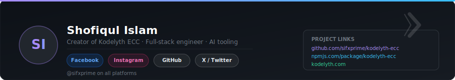
</div>

**Kodelyth ECC** is designed and maintained by **Shofiqul Islam** — full-stack engineer and AI tooling builder.

| Platform | Link |
|---|---|
| GitHub | [@sifxprime](https://github.com/sifxprime) |
| X / Twitter | [@sifxprime](https://x.com/sifxprime) |
| Facebook | [facebook.com/sifxprime](https://facebook.com/sifxprime) |
| Instagram | [@sifxprime](https://instagram.com/sifxprime) |
| npm | [npmjs.com/package/kodelyth-ecc](https://www.npmjs.com/package/kodelyth-ecc) |

---

<div align="center">

[](https://www.npmjs.com/package/kodelyth-ecc)
[](https://github.com/sifxprime/kodelyth-ecc)
[](LICENSE)
[](https://nodejs.org)

Built with craft. Zero telemetry. All yours.

</div>
